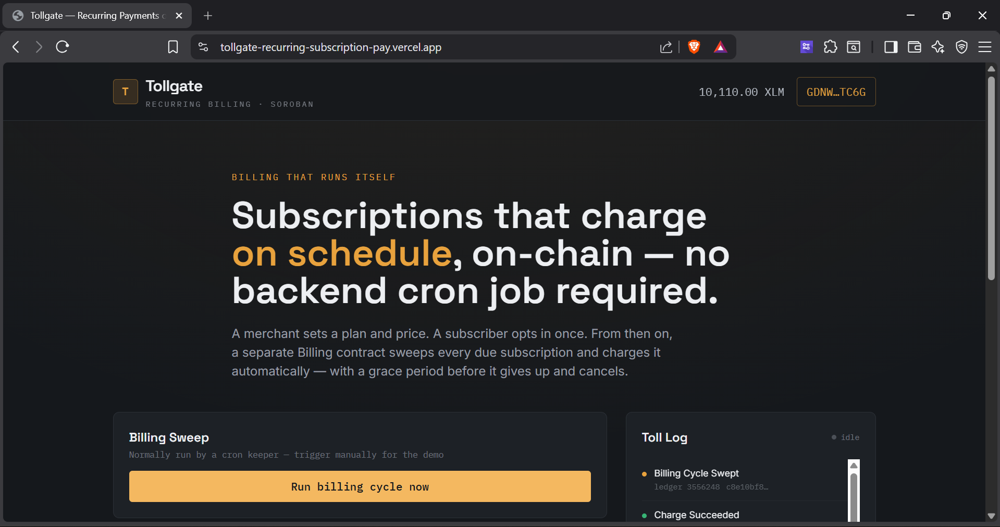
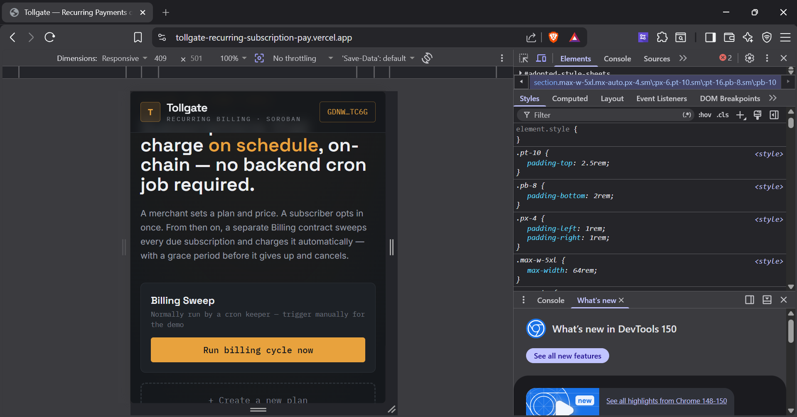
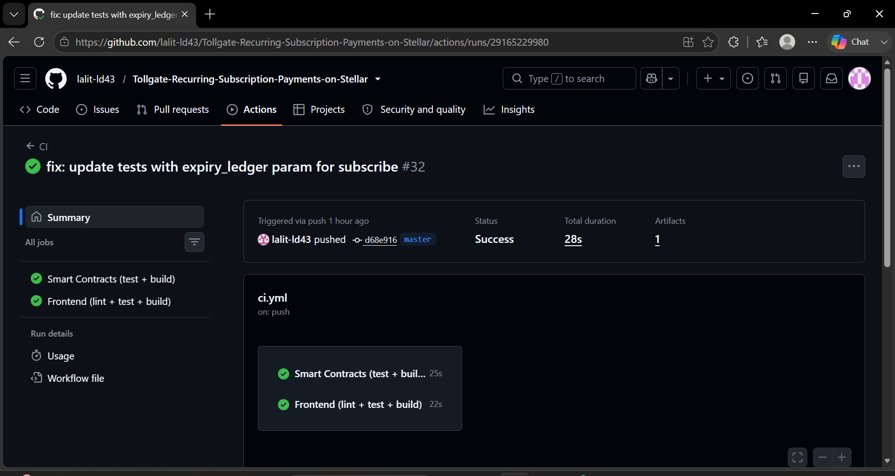
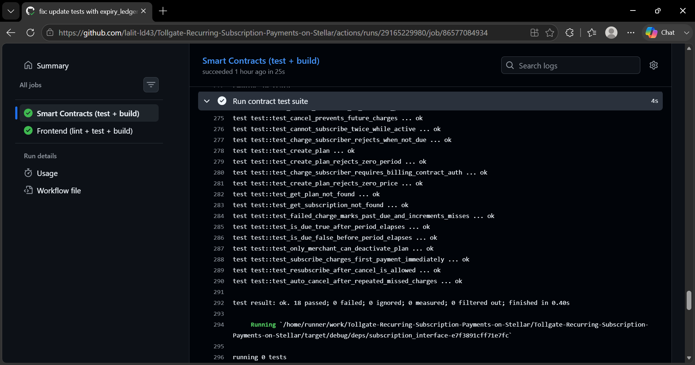

# 🚀 Tollgate - Decentralized Recurring Subscription Protocol

Tollgate is an advanced, production-ready subscription billing protocol built on Stellar (Soroban). It features a decentralized scheduler (Billing contract) that automatically sweeps due subscriptions and charges them without needing an off-chain backend or cron server. Subscribers opt in once and are charged automatically via a public `run_billing_cycle` call.

## 🔗 Live Demo & Video Pitch
- **Live Platform**: [tollgate-recurring-subscription-pay.vercel.app](https://tollgate-recurring-subscription-pay.vercel.app/)
- **Demo Video**: [Watch the Demo on Google Drive](https://drive.google.com/file/d/1Bb6IquHeamO64tG94EwmDTJIOEAf_CEm/view?usp=sharing)

## 🌟 Key Features

1. **Decentralized Subscription Billing**: A merchant sets a plan and price; a subscriber opts in once and pays the first cycle immediately.
2. **Keeper-Triggered Sweeps**: A separate Billing contract handles sweeping due subscriptions and charging them automatically via cross-contract calls.
3. **Grace Periods & Auto-Cancel**: Failed charges mark a subscription as past-due, giving a grace period before auto-cancelling after consecutive misses.
4. **Live Event Streaming**: Real-time event ingestion displays activity live on the frontend with countdown timers matching on-chain timestamps.

---

## 📡 Smart Contract Deployment & Interactivity

The protocol's smart contracts are deployed and verified on the Stellar Testnet. They are fully interactive through our frontend application.

- **Subscription Contract**: [`CDZZNQU6UT5AFAZEVU5PNRAAC4CGEZEP7XLE5KJPD52PG6OQWCVE2E7W`](https://stellar.expert/explorer/testnet/contract/CDZZNQU6UT5AFAZEVU5PNRAAC4CGEZEP7XLE5KJPD52PG6OQWCVE2E7W)
- **Billing Contract**: [`CB2BBHMKPWXMO5EB6GXOUP2UY3QCLJEJ3665CN3MIIQHJ4TZNH5FZR65`](https://stellar.expert/explorer/testnet/contract/CB2BBHMKPWXMO5EB6GXOUP2UY3QCLJEJ3665CN3MIIQHJ4TZNH5FZR65)
- **Example Transaction Hash (Interaction)**: [`c588e90786d49ede8a45bd897eea2bc7c6e2382920bd4832e4b387adabd085de`](https://stellar.expert/explorer/testnet/tx/c588e90786d49ede8a45bd897eea2bc7c6e2382920bd4832e4b387adabd085de)

---

## 📸 Platform Gallery & Submission Requirements

As per the submission checklist, here are the required screenshots demonstrating the platform's capabilities:

### 1. Product UI
The seamless frontend dashboard for merchants and subscribers.


### 2. Mobile Responsive UI
The platform is fully responsive and optimized for mobile devices.


### 3. CI/CD Pipeline Running
Automated GitHub Actions workflow running tests and deploying the frontend.


### 4. Test Output (Comprehensive Rust Tests)
Comprehensive Rust integration tests validating the smart contract logic.


---

## 🛠 Tech Stack

| Layer | Choice |
|---|---|
| Smart contracts | Rust + Soroban SDK 27 |
| Token standard | SEP-41 (Stellar Asset Contract compatible) |
| Frontend | React 18 + Vite + Tailwind CSS |
| Wallet | Freighter |
| Testing | `cargo test` (contracts), Vitest + Testing Library (frontend) |
| CI/CD | GitHub Actions |
| Hosting | Vercel |

## 🚀 Running Locally

### Contracts

```bash
rustup target add wasm32-unknown-unknown
cargo test --workspace
cargo build --release --target wasm32-unknown-unknown
```

### Frontend

```bash
cd frontend
npm install
npm test
npm run lint
npm run dev
```

For more detailed deployment instructions, see [DEPLOYMENT.md](./DEPLOYMENT.md). For deeper architectural insight, see [ARCHITECTURE.md](./ARCHITECTURE.md).
